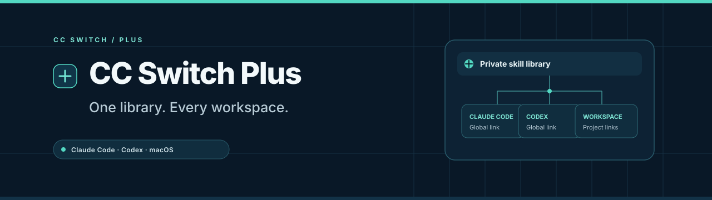
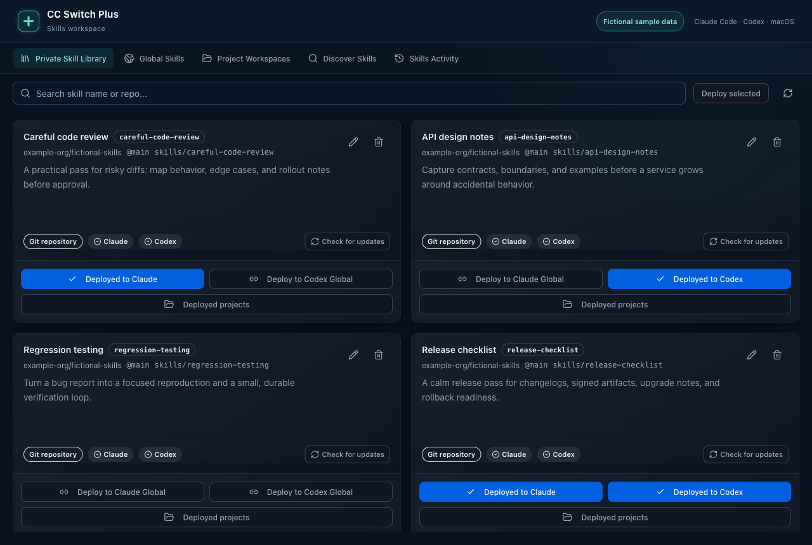
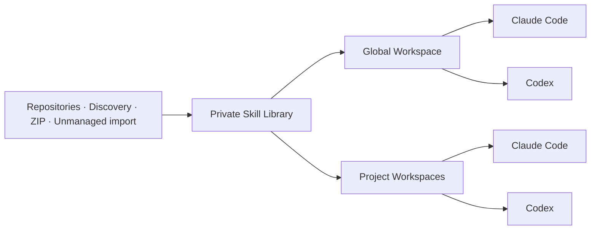

<div align="center">



# CC Switch Plus

**One Skill library. Claude Code and Codex. Every project.**

The Skill management edition of [CC Switch](https://github.com/farion1231/cc-switch): collect Skills once, deploy them where you work, and keep every link visible.

[](https://github.com/Andythropics/cc-switch-plus/actions/workflows/ci.yml)
[](https://github.com/Andythropics/cc-switch-plus/releases)
[](LICENSE)
[](#platform-support)
[](https://tauri.app)

English · [简体中文](README_ZH.md)

[Download](https://github.com/Andythropics/cc-switch-plus/releases) · [Quick start](#quick-start) · [Skills guide](docs/user-manual/en/3-extensions/3.3-skills.md) · [Discussions](https://github.com/Andythropics/cc-switch-plus/discussions) · [Contributing](CONTRIBUTING.md)

</div>

> **Independent MIT fork, currently in preview.** Maintained by [Andythropics](https://github.com/Andythropics), built on the work of Jason Young and the CC Switch contributors. The redesigned Skills system currently supports **macOS + Claude Code / Codex**. This repository is the home of Plus releases and support.

## Why Plus?

The same Skill often ends up in several tools and projects. Copies drift, local edits get lost in updates, and it becomes hard to tell which version an agent will load.

CC Switch Plus gives every managed Skill one home. Global and project deployments point to that same Library Skill. You decide which tool gets which Skill, and the app shows when the filesystem no longer matches that decision.

| What you need                     | What Plus provides                                                                                    |
| --------------------------------- | ----------------------------------------------------------------------------------------------------- |
| A reusable collection             | A private Skill Library with search, descriptions, source details, and compatibility results          |
| The right Skills in each project  | Independent Claude Code and Codex deployments, globally or in registered Project Workspaces           |
| Fewer duplicated copies           | Individual symbolic links to one Library Skill; edits through a deployed link reach the same content  |
| Confidence before updating        | Upstream update checks, local modification review, compatibility checks, and managed backups          |
| Visibility when something changes | Deployment inspection, explicit repair and forget actions, and structured activity history            |
| A path from existing setups       | Read-only discovery of unmanaged Skills and guided migration with review, backup, resume, and restore |

## A closer look



_The actual Library component, rendered with fictional sample Skills. Sample content is not bundled with the app._



Acquiring a Skill adds it to the Library. Deployment is a separate choice. Project deployments share the Library content; they are not independent project overrides.

### Built on CC Switch

Plus retains the upstream foundation: provider configuration and switching, MCP management, prompts, configuration profiles, local proxy features, and usage tools. The main investment in this fork is the Skills workflow. See the [upstream project](https://github.com/farion1231/cc-switch) for its broader history and the [manual](docs/user-manual/en/README.md) for inherited features.

## Quick start

### 1. Install

Download a macOS build from [Releases](https://github.com/Andythropics/cc-switch-plus/releases). Choose `aarch64` for Apple Silicon or `x86_64` for Intel. Open the DMG and drag **CC Switch Plus** into Applications, or extract the ZIP and move the app there.

Preview builds are not signed with an Apple Developer certificate or notarized. If macOS blocks a verified download, use **System Settings → Privacy & Security → Open Anyway**. Check the published `SHA256SUMS` before opening; see the [installation and migration guide](docs/INSTALL.md).

### 2. Review your existing setup

Open **Skills**. If a migration review appears, inspect the proposed changes and backups before applying. You can defer migration and browse in read-only mode.

**Upgrading from CC Switch?** Plus intentionally retains `~/.cc-switch/`, including the database and Skill Library. Disable the original app’s launch-at-login option, quit it, and back up that directory before first launch. The apps have distinct bundle identities but share application data; do not run them concurrently. Returning to an older version may require restoring your backup.

### 3. Build your Library

Use **Discover Skills** or import a ZIP. Review each Skill's content, source, and Claude / Codex compatibility. Existing unmanaged Skills can also be imported from **Global Skills** or **Project Workspaces**.

### 4. Deploy where you work

Choose Claude Code, Codex, or both. Deploy globally, or register a project and choose its Skills. Reopen the consumer session if it does not refresh Skill discovery automatically.

| Consumer    | Global target              | Project target                     |
| ----------- | -------------------------- | ---------------------------------- |
| Claude Code | `~/.claude/skills/<skill>` | `<project>/.claude/skills/<skill>` |
| Codex       | `~/.agents/skills/<skill>` | `<project>/.agents/skills/<skill>` |

Each managed target is a link to `~/.cc-switch/skills/<skill>` by default. `~/.codex/skills/` is a legacy migration location, not a new deployment target.

## Platform support

| Area                    | Current scope                                                                             |
| ----------------------- | ----------------------------------------------------------------------------------------- |
| Plus Skills             | macOS 12+, Claude Code and Codex                                                          |
| Project registration    | Local folders, Git repositories, and worktree roots                                       |
| Initial binary releases | macOS Apple Silicon and Intel, preview builds                                             |
| Windows / Linux         | Inherited application code remains; redesigned Skills are disabled with a platform notice |
| Nested Skill scopes     | Detected where applicable, but not managed by this first release                          |
| App updates             | Download Plus releases manually; upstream automatic updates are disabled                  |

## Your data stays understandable

- **Library ownership is explicit.** Importing a Library copy preserves the external source. Import and manage backs it up and replaces it with a managed link after confirmation.
- **Conflicts stay visible.** Real directories and foreign links are not silently overwritten. Repairs and replacements require explicit actions.
- **Workspaces stay local.** Library content and portable metadata can sync through configured WebDAV or S3. Project paths, deployment records, activity, and migration journals stay on each device.
- **Profiles stay separate.** Configuration profiles do not capture or apply Skill deployments.
- **Review unfamiliar Skills.** Compatibility checks validate structure; they do not certify Skill behavior. See [Security](SECURITY.md).

## Build from source

Install Node.js **22.12+**, pnpm **10.12.3**, current stable Rust, and the [Tauri 2 prerequisites](https://v2.tauri.app/start/prerequisites/). On macOS, install Xcode Command Line Tools with `xcode-select --install`.

```bash
git clone https://github.com/Andythropics/cc-switch-plus.git
cd cc-switch-plus
corepack enable
corepack prepare pnpm@10.12.3 --activate
pnpm install --frozen-lockfile
pnpm dev
```

To package the desktop app:

```bash
pnpm build
```

Build output is under `src-tauri/target/release/bundle/`. `pnpm dev:renderer` runs only the frontend; it does not provide the desktop backend. See [Contributing](CONTRIBUTING.md) for checks and repository structure.

## FAQ

**Is this the official CC Switch?** No. Plus is an independently maintained fork focused on Skill management. Original copyright notices and Git history are retained.

**Does acquiring a Skill enable it everywhere?** No. Acquisition and deployment are separate. Each consumer and workspace has its own deployment choice.

**Can I customize a deployed Skill for only one project?** A managed link edits the shared Library Skill. This release does not support independent project variants.

**Will sync recreate deployments on another Mac?** No. Sync transfers portable Library data; inspect and deploy Skills on each device separately.

**Can I use Homebrew or upstream packages?** Those install the original project. Use this repository's releases or build Plus from source.

## Join in

Start with [a bug report](https://github.com/Andythropics/cc-switch-plus/issues/new?template=bug_report.yml), [a feature idea](https://github.com/Andythropics/cc-switch-plus/issues/new?template=feature_request.yml), or [a discussion](https://github.com/Andythropics/cc-switch-plus/discussions). Chinese and English contributions are welcome.

[Contributing](CONTRIBUTING.md) · [Roadmap](ROADMAP.md) · [Changelog](CHANGELOG_PLUS.md) · [Code of Conduct](CODE_OF_CONDUCT.md) · [Release process](docs/RELEASING.md)

If Plus helps you keep your Skills organized, a star or a shared workflow helps others discover it.

## License and acknowledgements

[MIT](LICENSE). Copyright © 2025 Jason Young; © 2026 Andythropics and CC Switch Plus contributors for their modifications.

Thanks to [CC Switch](https://github.com/farion1231/cc-switch) and its contributors for the foundation, and to the Tauri, React, and Rust communities. See [NOTICE](NOTICE) for provenance. Third-party tools, Skills, and provider services retain their own licenses and terms.
