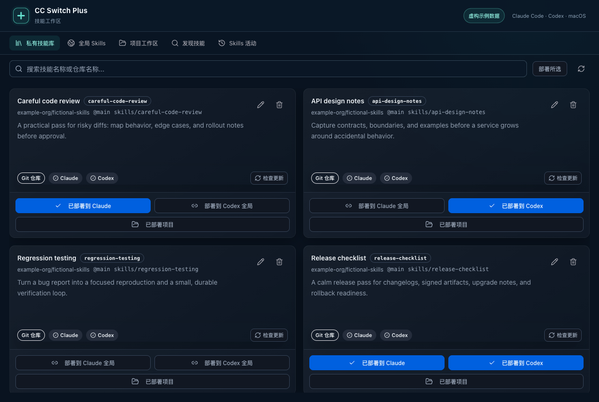
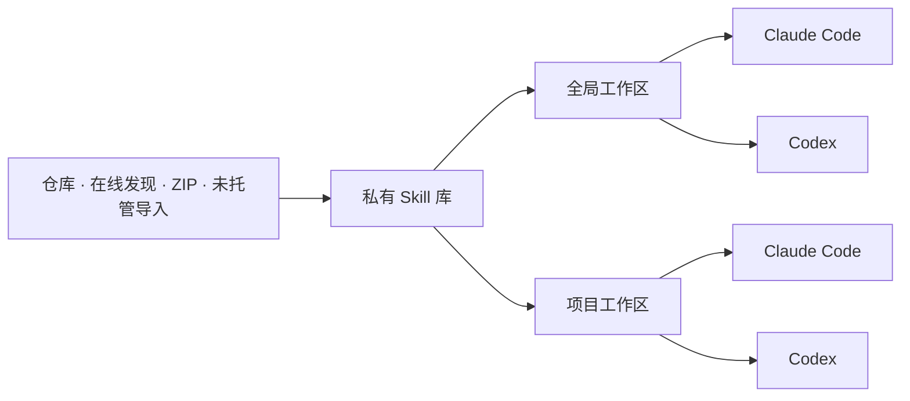

<div align="center">


# CC Switch Plus

**一个 Skill 库，连接 Claude Code、Codex 和你的每个项目。**

基于 [CC Switch](https://github.com/farion1231/cc-switch) 的 Skill 管理增强版：集中收集，按需部署，随时看清每份 Skill 的状态。

[](https://github.com/Andythropics/cc-switch-plus/actions/workflows/ci.yml)
[](https://github.com/Andythropics/cc-switch-plus/releases)
[](LICENSE)
[](#平台支持)
[](https://tauri.app)

[English](README.md) · 简体中文

[下载安装](https://github.com/Andythropics/cc-switch-plus/releases) · [快速上手](#快速上手) · [Skills 使用指南](docs/user-manual/zh/3-extensions/3.3-skills.md) · [讨论区](https://github.com/Andythropics/cc-switch-plus/discussions) · [参与贡献](CONTRIBUTING.md)

</div>

> **独立维护的 MIT 开源分支，当前处于预览阶段。** 由 [Andythropics](https://github.com/Andythropics) 基于 Jason Young 与 CC Switch 社区的工作继续开发。新版 Skill 管理目前支持 **macOS + Claude Code / Codex**。Plus 的发布、反馈和维护以本仓库为准。

## 为什么做 Plus？

同一个 Skill，常常散落在不同工具和项目里。复制得越多，越难知道哪份是最新版本；手动改过的内容，也容易在更新时丢失。

CC Switch Plus 为每份受管理的 Skill 保留一个统一来源。全局部署与项目部署都指向同一份技能库内容。你决定哪个工具、哪个项目需要它，应用负责展示实际文件状态是否与部署记录一致。

| 你需要什么              | Plus 提供什么                                                 |
| ----------------------- | ------------------------------------------------------------- |
| 可复用的 Skill 集合     | 私有技能库，支持搜索、描述、来源信息和兼容性结果              |
| 每个项目有合适的 Skills | 分别为 Claude Code、Codex 配置全局部署与项目部署              |
| 减少重复副本            | 每份部署使用符号链接；通过链接编辑时，修改同一份技能库内容    |
| 更新前心里有数          | 检查上游更新，审查本地修改与兼容性，建立受管理的备份          |
| 及时发现异常            | 检查部署状态，显式修复或忘记记录，查看结构化操作历史          |
| 接管已有配置            | 只读发现未托管 Skills，提供可审查、备份、续跑与恢复的迁移流程 |

## 看看实际界面



_截图使用实际技能库组件与虚构示例 Skills 生成；示例内容不随应用附带。_



获取 Skill 只会把内容加入技能库，部署需要另行选择。项目部署共享技能库内容，不会创建独立的项目覆盖版本。

### 延续 CC Switch 的能力

Plus 保留了上游的供应商配置与切换、MCP 管理、提示词、配置方案、本地代理和用量工具。本分支主要围绕 Skills 工作流持续增强。完整历史可查看[上游项目](https://github.com/farion1231/cc-switch)，继承功能可参考[使用手册](docs/user-manual/zh/README.md)。

## 快速上手

### 1. 安装应用

前往 [Releases](https://github.com/Andythropics/cc-switch-plus/releases) 下载 macOS 构建：Apple Silicon 选 `aarch64`，Intel 选 `x86_64`。打开 DMG，将 **CC Switch Plus** 拖入「应用程序」；也可解压 ZIP 后移动应用。

预览构建尚未使用 Apple 开发者证书签名或公证。如果 macOS 拦截了已核验的下载，可在「**系统设置 → 隐私与安全性 → 仍要打开**」中处理。打开前请核对发布页提供的 `SHA256SUMS`，详见[安装与迁移指南](docs/INSTALL.md)。

### 2. 检查已有配置

打开 **Skills**。如果出现迁移审查，请先查看计划变更和备份，再决定应用。也可以暂缓迁移，以只读方式浏览。

**从 CC Switch 升级？** Plus 为了兼容现有数据，继续使用 `~/.cc-switch/`，其中包括数据库与技能库。首次启动前请关闭原版的开机自启、退出原版并备份整个目录。两个应用虽然有不同的应用标识，仍共享数据，**请勿同时运行**。回到旧版本可能需要恢复升级前的备份。

### 3. 建立技能库

使用「**发现 Skills**」或导入 ZIP，检查每份 Skill 的内容、来源和 Claude / Codex 兼容性。已有的未托管 Skills 也可以从全局 Skills 或项目工作区导入。

### 4. 部署到需要的地方

选择 Claude Code、Codex 或两者。可以全局部署，也可以注册项目后单独选择它需要的 Skills。如果工具没有自动刷新 Skill 列表，请重新打开该工具的会话。

| 使用工具    | 全局目标                   | 项目目标                           |
| ----------- | -------------------------- | ---------------------------------- |
| Claude Code | `~/.claude/skills/<skill>` | `<project>/.claude/skills/<skill>` |
| Codex       | `~/.agents/skills/<skill>` | `<project>/.agents/skills/<skill>` |

默认情况下，每个受管理的目标都是指向 `~/.cc-switch/skills/<skill>` 的链接。`~/.codex/skills/` 仅用于旧配置迁移，不是新版部署目标。

## 平台支持

| 能力              | 当前范围                                                  |
| ----------------- | --------------------------------------------------------- |
| Plus Skill 管理   | macOS 12+，Claude Code 与 Codex                           |
| 项目注册          | 本地目录、Git 仓库根目录、worktree 根目录                 |
| 首批安装包        | macOS Apple Silicon 与 Intel，预览构建                    |
| Windows / Linux   | 保留继承的应用代码；新版 Skill 管理显示平台说明，暂不启用 |
| 嵌套 Skill 作用域 | 在适用场景下提示，但首版不接管管理                        |
| 应用更新          | 从 Plus 发布页手动下载；已关闭上游自动更新                |

## 数据如何管理

- **归属明确。**「导入技能库副本」保留外部源目录；「导入并管理」经过确认和备份后，才会把原位置替换成受管理的链接。
- **冲突可见。** 不会静默覆盖真实目录或外部链接。修复与替换需要明确操作。
- **工作区留在本机。** 配置 WebDAV 或 S3 后，可同步技能库内容与可移植元数据；项目路径、部署记录、操作历史和迁移日志保留在各自设备。
- **配置方案独立。** 配置方案不会保存或应用 Skill 部署。
- **先了解 Skill，再部署。** 兼容性检查验证的是结构，不代表对其行为的安全认证。参阅[安全策略](SECURITY.md)。

## 从源码运行

准备 Node.js **22.12+**、pnpm **10.12.3**、当前稳定版 Rust，以及 [Tauri 2 开发环境](https://v2.tauri.app/start/prerequisites/)。macOS 可通过 `xcode-select --install` 安装 Xcode Command Line Tools。

```bash
git clone https://github.com/Andythropics/cc-switch-plus.git
cd cc-switch-plus
corepack enable
corepack prepare pnpm@10.12.3 --activate
pnpm install --frozen-lockfile
pnpm dev
```

打包桌面应用：

```bash
pnpm build
```

构建结果位于 `src-tauri/target/release/bundle/`。`pnpm dev:renderer` 只启动前端，不提供桌面后端。检查命令和代码结构见[贡献指南](CONTRIBUTING.md)。

## 常见问题

**这是 CC Switch 官方版本吗？** 不是。Plus 是独立维护、专注 Skill 管理的增强分支，保留原作者版权声明与 Git 历史。

**获取一个 Skill 后，会自动在所有地方启用吗？** 不会。获取与部署分开，每个工具、每个工作区独立选择。

**能不能只修改某个项目里的 Skill？** 受管理的链接指向共享技能库。当前版本不提供独立的项目变体。

**同步后会自动恢复另一台 Mac 的部署吗？** 不会。同步传输可移植的技能库数据，每台设备分别检查和部署。

**能使用上游 Homebrew 或其他安装源吗？** 那些安装的是原版。请使用本仓库发布的 Plus 安装包，或从源码构建。

## 一起完善

欢迎[报告问题](https://github.com/Andythropics/cc-switch-plus/issues/new?template=bug_report.yml)、[提出功能建议](https://github.com/Andythropics/cc-switch-plus/issues/new?template=feature_request.yml)，或在[讨论区](https://github.com/Andythropics/cc-switch-plus/discussions)分享使用方式。中文、英文贡献都欢迎。

[贡献指南](CONTRIBUTING.md) · [路线图](ROADMAP.md) · [增强版更新日志](CHANGELOG_PLUS.md) · [行为准则](CODE_OF_CONDUCT.md) · [发布流程](docs/RELEASING.md)

如果 Plus 帮你理顺了 Skill 管理，欢迎点一个 Star，或分享你的工作流，让更多人发现它。

## 协议与致谢

使用 [MIT 协议](LICENSE)。原始版权 © 2025 Jason Young；修改部分版权 © 2026 Andythropics 与 CC Switch Plus 贡献者。

感谢 [CC Switch](https://github.com/farion1231/cc-switch) 及其贡献者打下的基础，也感谢 Tauri、React 与 Rust 社区。项目来源见 [NOTICE](NOTICE)。第三方工具、Skills 和供应商服务仍遵循各自的协议与条款。
